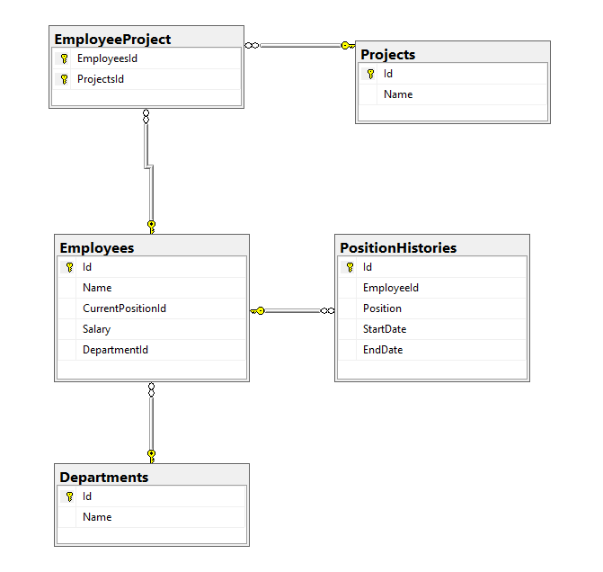

### Documentación

- Arquitectura Usada: **Arquitectura en Capas**
- Patrones de Diseño Usados: **Repository Pattern**, **Strategy Pattern**
- Implementación Autenticación y Autorización: Para este caso utilizaría JWT, ASP.NET Core Identity y esquemas basado en roles.
- Concepto de Middleware en ASP.NET Core: Es un componente de software ensamblado en una canalización (_pipeline_) para manejar solicitudes y respuestas HTTP. Cada fragmento inspecciona o modifica la petición, decide si pasa el control al siguiente componente o corta el flujo, y procesa la respuesta de regreso.
- Ejemplo Protección de Endpoints EmployeesController:
		A nivel de Controller:
		```    [Authorize]
		    public class EmployeesController : ControllerBase
		    {```
		A nivel de Endpoints:
		```[HttpGet]
        [Authorize(Roles = "Admin,User")]
        public async Task<IActionResult> GetAll()
        {
            var employees = await _repository.GetAllAsync();
            var response = employees.Select(MapToResponseDto);
            return Ok(response);
        }```
- Esquema de Base de Datos:
	- 
- Consulta LINQ:
		```var employees = await _context.Employees
			.Where(e => e.DepartmentId == departmentId && e.Projects.Any())
			.Include(e => e.Department)
			.Include(e => e.Projects)
			.ToListAsync();
	